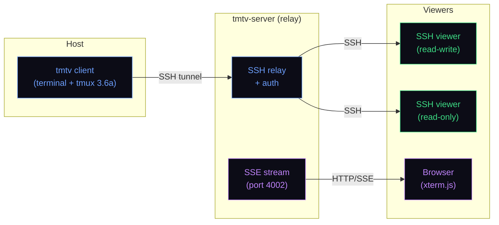
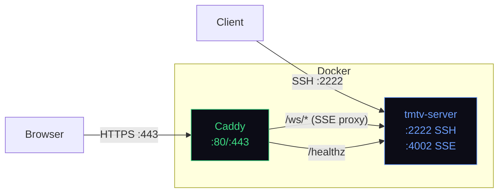

# tmtv

Terminal sharing for IT professionals. Share your terminal over SSH and the web — built on tmux 3.6a.

## Quick start

```sh
# Install
curl -fsSL https://tmtv.se/install.sh | sh

# Start sharing
tmtv
```

That's it. tmtv connects to tmtv.se and prints your session tokens:

```
ssh TOKEN@tmtv.se              # read-write access
ssh ro-TOKEN@tmtv.se           # read-only access
```

### Enable web sharing

SSH sharing is always on. Web sharing is opt-in:

```sh
tmtv set -g tmtv-web-sharing on
# [tmtv] web session: https://tmtv.se/s/TOKEN
```

Share the URL — viewers watch in their browser, no install needed.

To auto-enable web sharing, add to `~/.tmtv.conf`:

```
set -g tmtv-web-sharing on
```

### Interactive web viewers

By default, web viewers can only watch. To let RW web viewers type:

```sh
tmtv set -g tmtv-web-input on
```

When enabled, web viewers connected via the RW token can type in the terminal. RO token viewers remain view-only. A badge in the viewer titlebar shows the session mode ("interactive" or "view-only").

### Named sessions

Pick a memorable name instead of a random token:

```
# In ~/.tmtv.conf
set -g tmtv-session-name demo
```

Your session is now at (example prefix):

- `ssh 0123456789abcdef0123456789abcdef-demo@tmtv.se` (SSH read-write)
- `ssh ro-demo@tmtv.se` (SSH read-only)
- `https://tmtv.se/s/demo` (web)

Names must be 3-32 characters, alphanumeric and hyphens only.

### Reconnects and restarts

With a **v2.0.4 or newer host client and relay**, automatic reconnects preserve
the SSH read-write, SSH read-only and web links. This works for unnamed sessions
too. The host keeps a private random identity in memory; viewer tokens cannot
be used to claim that identity. Named RW links now have a 32-character
cryptographic prefix instead of a five-digit number.

Detaching and reattaching to the same running host preserves its identity.
Ending that host process and starting a new one deliberately creates fresh
credentials, even with the same name. Nothing is saved to disk for resumption.
Names remain availability-based, not permanently reserved: an unrelated host
can occupy a name while yours is offline. The client remembers any assigned
suffix and warns if a reconnect changes its RW link.

Older clients and relays remain compatible, but keep their previous reconnect
behavior. Upgrade both ends to get continuity; existing running hosts need to
be restarted once with the new client.

### Password-protected sessions

Require a password for viewers to join:

```sh
tmtv -p secret
```

SSH viewers must authenticate with the password — public key authentication alone is rejected. Web viewers see a password prompt before the terminal loads. Passwords are SHA-256 hashed server-side and never stored in plain text.

Can also be set in config:

```
# In ~/.tmtv.conf
set -g tmtv-session-password secret
```

### Session recording

Record your terminal session to an [asciinema](https://asciinema.org) `.cast` file:

```sh
tmtv set -g tmtv-recording on
```

Recordings are saved to `~/.tmtv/recordings/`. Play them back with `asciinema play`:

```sh
asciinema play ~/.tmtv/recordings/demo-1741737600.cast
```

Add a toggle keybinding to start/stop recording with `prefix + R`:

```
# In ~/.tmtv.conf
bind R if -F '#{==:#{tmtv-recording},1}' \
  'set -g tmtv-recording off; display "Recording stopped"' \
  'set -g tmtv-recording on; display "Recording started"'
```

### Session expiry

Set a time-to-live for your session:

```
# In ~/.tmtv.conf
set -g tmtv-link-ttl 3600    # expire after 1 hour
```

The session auto-terminates after the TTL. Viewers see the countdown in the session notification.

### All sharing options

Here's every sharing option in one place:

```
# ~/.tmtv.conf

# Web sharing (off by default, SSH is always on)
set -g tmtv-web-sharing on

# Allow RW web viewers to type (off by default)
set -g tmtv-web-input on

# Named session — gives you a memorable URL
set -g tmtv-session-name demo

# Password — required for all viewers (SSH and web)
set -g tmtv-session-password secret

# Shared clipboard (on by default) — RO viewers excluded
set -g tmtv-shared-clipboard on

# Record terminal to asciinema .cast file
set -g tmtv-recording on

# Session lifetime in seconds (0 = no limit)
set -g tmtv-link-ttl 3600
```

All options can be combined freely. A named session with password and web input gives you:
- `ssh <32-character-prefix>-demo@tmtv.se` — SSH read-write (password required)
- `ssh ro-demo@tmtv.se` — SSH read-only (password required)
- `https://tmtv.se/j/demo` — web viewer with typing enabled (password prompt shown)

Options can also be toggled at runtime:

```sh
tmtv set -g tmtv-web-sharing on    # enable web sharing mid-session
tmtv set -g tmtv-web-input off     # disable web input mid-session
tmtv set -g tmtv-shared-clipboard off  # disable clipboard sharing mid-session
```

## GitHub Action

Debug CI failures by SSH-ing into your runner. Drop-in replacement for `action-tmate`:

```yaml
- name: Debug via tmtv
  if: failure()
  uses: sa3lej/action-tmtv@v1
  with:
    limit-access-to-actor: true
```

Migrating from action-tmate? One-line diff:

```diff
- uses: mxschmitt/action-tmate@v3
+ uses: sa3lej/action-tmtv@v1
```

See [action-tmtv](https://github.com/sa3lej/action-tmtv) for full docs.

## How it works



The host runs `tmtv`, which opens an SSH tunnel to the relay server. The server authenticates viewers and forwards the terminal stream — read-write or read-only over SSH, view-only over SSE to browsers. Web viewers see exactly what SSH viewers see, rendered by xterm.js.

## Features

- Full tmux 3.6a terminal multiplexer
- Instant session sharing over SSH with read-write and read-only tokens
- Password-protected sessions — viewers must authenticate before connecting
- Shared clipboard — copy on host, paste on viewers (and vice versa)
- Web viewer with xterm.js and WebGL rendering
- Interactive web input — RW web viewers can type when enabled by the host
- Late-join support — browser viewers see current terminal state
- Server-Sent Events streaming — works through proxies and firewalls
- Live viewer counts — `S:N W:N` in tmux status bar and web titlebar
- Dynamic page titles — link previews show the session name (Slack, Discord, iMessage)
- SIXEL graphics support — images display in terminal and stream to viewers
- Session recording to asciinema `.cast` format
- Per-user input API for multiplayer terminal apps
- Read-only viewers can disconnect cleanly with Ctrl-Q
- Automatic reconnection with exponential backoff on server disconnect
- Zero config — just type `tmtv`

## Format variables

Session URLs are available as tmux format variables:

| Variable | Description |
|----------|-------------|
| `#{tmtv_ssh}` | SSH connection string (read-write) |
| `#{tmtv_ssh_ro}` | SSH connection string (read-only) |
| `#{tmtv_web}` | Web viewer URL |
| `#{tmtv_session_name}` | Named session name (if set) |
| `#{tmtv_ssh_viewers}` | Number of connected SSH viewers |
| `#{tmtv_web_viewers}` | Number of connected web viewers |

Example: `tmtv display-message -p '#{tmtv_web}'`

## Per-user input API

tmtv exposes a Unix socket (`TMTV_INPUT_SOCKET`) that programs running inside a session can connect to for per-user input events. Each viewer gets a unique identity, enabling multiplayer terminal games, in-session chat, and collaborative tools where you need to know *who* typed *what*.

Programs can subscribe to viewer join/leave notifications, receive per-user keystrokes, and control whether keys are mirrored to the terminal or captured exclusively.

See [docs/input-socket.md](docs/input-socket.md) for the wire protocol, message types, and examples.

## Status bar

tmtv prepends live viewer counts to the standard tmux status bar. The default `status-right` is:

```
S:#{tmtv_ssh_viewers} W:#{tmtv_web_viewers} "#{=21:pane_title}" %H:%M %d-%b-%y
```

This gives you something like:

```
S:2 W:1 "myhost" 14:30 09-Mar-26
```

Everything after the viewer counts is the stock tmux default — pane title, 12-hour clock, and date. This is set via the tmux options system, so you can override it in `~/.tmtv.conf` like any tmux option.

### Customizing the status bar

Add to `~/.tmtv.conf`:

```
set -g status-right 'S:#{tmtv_ssh_viewers} W:#{tmtv_web_viewers} "#{=21:pane_title}" %H:%M %Y-%m-%d'
```

This keeps the viewer counts and pane title, switches to a 24-hour clock (`%H:%M`), and uses ISO date format (`%Y-%m-%d`).

Any valid tmux `status-right` format works — tmtv is a full tmux, so you have access to all tmux format variables alongside the tmtv-specific ones. See `man tmux` for the complete list of format strings.

## Using tmtv as tmux

tmtv is a full tmux replacement. All tmux commands work:

```sh
tmtv new-session -s work
tmtv split-window -h
tmtv list-sessions
tmtv attach -t work
```

## Self-hosting

Run your own tmtv relay server instead of using tmtv.se.

### Docker Compose (recommended)

```sh
docker compose up -d
```

That's it — SSH sharing on port 2222. Clients connect via `ssh TOKEN@your.host.com -p 2222`.

For production with TLS and web viewing, add Caddy as a reverse proxy:

```sh
TMTV_DOMAIN=share.example.com docker compose --profile tls up -d
```

This starts both `tmtv-server` and a Caddy instance with automatic TLS. SSH host keys and TLS certificates persist in Docker volumes.

#### Environment variables

| Variable | Description | Default |
|----------|-------------|---------|
| `TMTV_DOMAIN` | Hostname in connection strings and TLS cert | `localhost` |
| `TMTV_SSH_PORT` | SSH listen port (host-side) | `2222` |
| `TMTV_IDLE_TIMEOUT` | Disconnect idle sessions (seconds) | `3600` |
| `TMTV_MAX_LIFETIME` | Maximum session lifetime (seconds) | `86400` |
| `TMTV_LOG_LEVEL` | Log verbosity (0=quiet, 1+=verbose) | `0` |

#### Docker architecture



The Caddy profile is optional — without it, only SSH sharing is available. The SSE port (4002) is internal only; Caddy proxies it at `/ws/*`.

### Building from source

#### Linux (Debian/Ubuntu)

```sh
sudo apt-get install build-essential autoconf automake pkg-config \
  libevent-dev libncurses-dev libssh-dev libmsgpack-dev libbsd-dev \
  bison libutf8proc-dev

sh autogen.sh
./configure --enable-sixel
make -j$(nproc)
```

This produces `tmtv` (client) and `tmtv-server`.

#### macOS (client only)

```sh
brew install autoconf automake pkg-config libevent libssh msgpack-c bison utf8proc

export PATH="$(brew --prefix bison)/bin:$PATH"
sh autogen.sh
./configure --enable-utf8proc --enable-sixel
make -j$(sysctl -n hw.ncpu)
```

#### Static Linux binaries (Docker)

Build fully static musl binaries for any architecture:

```sh
docker build --build-arg PLATFORM=amd64 --output type=local,dest=./out .
# Produces: out/build/tmtv and out/build/tmtv-server (zero dependencies)
```

Supported platforms: `amd64`, `arm64`, `arm/v7`, `arm/v6`, `i386`.

### Server setup

#### 1. Generate SSH host keys

```sh
mkdir -p /etc/tmtv/keys
ssh-keygen -t ed25519 -f /etc/tmtv/keys/ssh_host_ed25519_key -N ''
ssh-keygen -t rsa -b 3072 -f /etc/tmtv/keys/ssh_host_rsa_key -N ''
```

#### 2. Install the binary

```sh
sudo cp tmtv-server /usr/local/bin/
```

#### 3. Create a systemd service

```ini
# /etc/systemd/system/tmtv-server.service
[Unit]
Description=tmtv relay server
After=network.target

[Service]
ExecStart=/usr/local/bin/tmtv-server \
  -k /etc/tmtv/keys \
  -p 22 \
  -h your.host.com \
  -v
Restart=always
NoNewPrivileges=yes
ProtectSystem=strict
ReadWritePaths=/tmp

[Install]
WantedBy=multi-user.target
```

```sh
sudo systemctl daemon-reload
sudo systemctl enable --now tmtv-server
```

That's it — SSH sharing works now. Clients connect via `ssh TOKEN@your.host.com`.

#### 4. Web viewer (optional)

Web sharing requires an SSE endpoint and a reverse proxy with TLS. Add `-z 4002` to the server flags to enable SSE streaming, then put [Caddy](https://caddyserver.com) in front for TLS and routing.

A production-ready Caddyfile is provided in [`deploy/Caddyfile`](deploy/Caddyfile). It includes Caddy templates for dynamic page titles (link previews show the session name in Slack, Discord, iMessage). Replace `tmtv.se` with your hostname.

Build and deploy the web viewer:

```sh
cd site && npm ci && npm run build && cd ..
sudo mkdir -p /var/www/tmtv
sudo cp site/dist/index.html /var/www/tmtv/
sudo cp site/dist/viewer/index.html /var/www/tmtv/viewer.html
sudo cp web/viewer.js /var/www/tmtv/
```

#### 5. Firewall

Open these ports:

| Port | Protocol | Purpose |
|------|----------|---------|
| 22 | TCP | tmtv SSH (clients and viewers) |
| 443 | TCP | HTTPS (web viewer and landing page) |

Port 4002 (SSE) should NOT be exposed — Caddy handles it internally.

#### Server flags

| Flag | Description | Default |
|------|-------------|---------|
| `-k` | SSH host keys directory | `keys` |
| `-p` | SSH listen port | `2222` |
| `-q` | SSH port shown in connection strings | same as `-p` |
| `-h` | Hostname in connection strings | system hostname |
| `-z` | SSE port for web viewer | disabled |
| `-b` | Bind address | all interfaces |
| `-A` | Require authorized keys (reject clients without `-a`) | off |
| `-x` | Enable PROXY protocol (for use behind load balancers) | off |
| `-V` | Print version and exit | — |
| `-v` | Increase log verbosity | quiet |

#### SSH security

tmtv-server uses libssh (>= 0.9.5) with modern defaults:

- **Key exchange**: curve25519-sha256, ecdh-sha2-nistp256/384/521
- **Ciphers**: chacha20-poly1305, aes256-gcm, aes128-gcm, aes256-ctr, aes128-ctr
- **Host keys**: Ed25519, ECDSA, RSA (SHA-256/SHA-512 signatures only)
- **No weak algorithms**: no 3DES, no DH group1/group14-sha1, no ssh-rsa with SHA-1

### Client config for self-hosted server

```
# ~/.tmtv.conf
set -g tmtv-server-host your.host.com
set -g tmtv-server-port 22
set -g tmtv-server-rsa-fingerprint SHA256:...
set -g tmtv-server-ed25519-fingerprint SHA256:...
```

Get fingerprints:

```sh
ssh-keygen -lf /etc/tmtv/keys/ssh_host_ed25519_key.pub
ssh-keygen -lf /etc/tmtv/keys/ssh_host_rsa_key.pub
```

### Running tests

#### Unit and functional tests

Run locally — no server required:

```sh
cd tests && make all
```

#### Integration tests

Run against a live tmtv-server (180+ tests covering SSH, SSE, web viewer, pane operations, viewer counts, web input, SIXEL, clipboard, flood resilience, and more).

Tests run ON the test server in local mode:

```sh
# Quick mode (skips slow tests)
TEST_HOST=localhost WEB_HOST=staging.tmtv.se sh test-integration.sh --quick

# Full suite
TEST_HOST=localhost WEB_HOST=staging.tmtv.se sh test-integration.sh
```

Or use the deploy script:

```sh
scripts/staging-deploy.sh --test-only          # quick mode
scripts/staging-deploy.sh --test-only --full-tests  # full suite
```

## License

ISC license, same as tmux.

## Support

If tmtv is useful to you, [buy me a coffee](https://buymeacoffee.com/lejo).

## Acknowledgments

- [tmux](https://github.com/tmux/tmux) by Nicholas Marriott and contributors
- [tmate](https://github.com/tmate-io/tmate) by Rene Dumont and contributors
